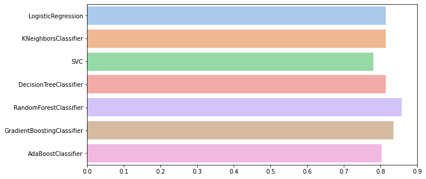
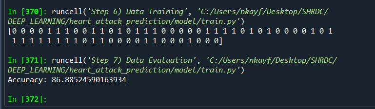
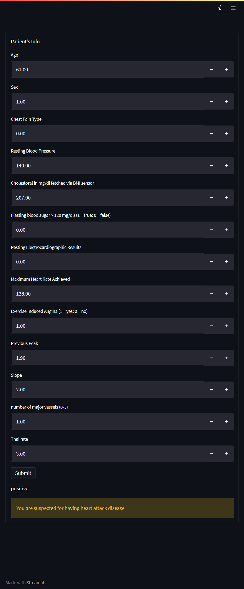

# Heart Attack Prediction App
This project is a part of the assessment for SHRDC Data Science course

#### -- Project Status: [Completed]

## Project Intro/Objective
The purpose of this project is to produce a machine learning app to predict the possibility of a patient to have a heart attack disease

### Methods Used
* Inferential Statistics
* Machine Learning
* Data Visualization
* Predictive Modeling

### Technologies
* Python
* Pandas, Numpy, Sklearn
* Streamlit

## Getting Started

1. Clone this repo (for help see this [tutorial](https://help.github.com/articles/cloning-a-repository/)).
2. Raw Data is being kept [https://github.com/nkayfaith/heart_attack_prediction/blob/main/data/heart.csv] within this repo.
    
3. Data processing/transformation scripts are being kept [https://github.com/nkayfaith/heart_attack_prediction/blob/main/model/train.py]

## Discussion, Analysis and Result
1. Machine Learning model selected to train the dataset for this model is RandomForestClassifier as it scores the highest in term of accuracy.

2. Model is trained with max_depth = 7 with accuracy of 89.88%

3. A simple app is built for end-user testing

5. 

## Credits
https://www.kaggle.com/rashikrahmanpritom/heart-attack-analysis-prediction-dataset
